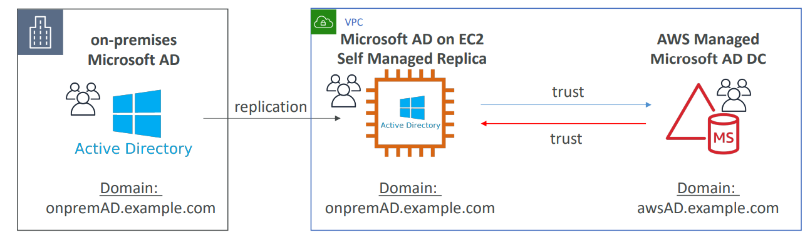

# Identity Federation

Identity Federation is used to provide users/entities outside of aws permissions to access aws resources.

> IAM supports IdPs that are compatible with OpenID Connect (OIDC) or SAML 2.0 (Security Assertion Markup Language 2.0)

- Web Identity Federation: Useful for mobile app use cases. Use well known IDP such as Google or Facebook or Amazon for sign-in and get token. Exchange this token for short-term credentials that allow aws services access.
    - Cognito is best suited for Web Identity Federation. 
    - If you don't use Amazon Cognito, then you must write code that interacts with a web IdP, such as Facebook, and then calls the AssumeRoleWithWebIdentity API to trade the authentication token you get from those IdPs for AWS temporary security credentials.  
- SAML 2.0 Federation: This feature enables federated single sign-on (SSO), so users can log into the AWS Management Console or call the AWS API operations without you having to create an IAM user for everyone in your organization.
    - AWS SSO is best suited for SMAL 2.0 Federation   


## Federation Services:
### SAML2.0 Federation:

- Integration with Microsoft ADFS (Active Directory Federation Services)
- Under the hood: uses STS AssumeRolewithSAML
- Involves creation of SAML Identity Provider in IAM
- Can provide *trust policy* and *permission policies* as usual. The principal here would be **saml-provider**

SAML Assertion Workflow:


Example Trust Policy:
```
{
  "Version": "2012-10-17",
  "Statement": [{
    "Effect": "Allow",
    "Principal": {"Federated": "arn:aws:iam::account-id:saml-provider/ExampleOrgSSOProvider"},
    "Action": "sts:AssumeRoleWithSAML",
    "Condition": {"StringEquals": {
      "saml:edupersonorgdn": "ExampleOrg",
      "saml:aud": "https://signin.aws.amazon.com/saml"
    }}
  }]
}
```
   
### AWS SSO:

- AWS SSO Federation is the new and managed way. Underlying uses SAML 2.0 Federation.
- STS Integration is automatically handled with SSO.
- Integrated with AWS Organizations
- Centralized Permissions Management
- Centralizing auditing with Cloudtrail
-  Identity source:
     - SSO-built in: manage users & groups
     - Active Directory through Directory Services (AWS Managed Microsoft AD or AD Connector)
     - External Identity Provider: any SAML 2.0 Identity Provider (e.g., Azure AD, Okta Universal Directory) 
- Integration with MS AD
     - aws managed microsoft AD
     - AWS Managed Microsoft AD with 2-way forest trust with on-premises AD
     - AD Connector to on-premises AD       
- Control tower: to automate creation of accounts with organizations through service catalog. 
     - Preventive – using SCPs (e.g., Disallow Creation of Access Keys for the Root User)
     - Detective – using AWS Config (e.g., Detect Whether MFA for the Root User is Enabled)

### Custom Identity Broker Application

- Use only if Identity provider is NOT compatible with SAML 2.0
- *Disadvantage:* The identity broker must determine appropriate IAM role (with SAML 2.0, the assertion has a role)
- Uses STS API _AssumeRole_ or _GetFederationToken_

### Web Identity Federation - without Cognito (not recommended)

- Uses AssumeRoleWithWebIdentity 

### Web Identity Federation - with Cognito

- Preferred by aws.
- Can create Roles within Cognito with least privileges.
- **Key Advantages**: MFA, Data sync and anonymous users support.

### Web Identity Federation - IAM Policy

- After identity federation, can identify a user in IAM Policy through variables.
- Example: cognito- identity.amazonaws.com:sub (or) accounts.google.com:sub


## Directory Services

### ADFS (AD Federation Services)

- ADFS provides Single Sign-On across applications
- SAML across 3rd party: AWS Console, Dropbox, Office365, etc…

### AWS Managed Microsoft AD

- Enables use of managed Active Directory **in the AWS Cloud**.
- Establish “trust” connections with your on-premises AD. (I.e. extend on-premises AD)
- To connect to on-premises AD,  Must establish a Direct Connect (DX) or VPN connection
- Multi AZ deployment of AD in 2 AZ, # of DC (Domain Controllers) can be increased for scaling
- Automated Multi-Region replication of your directory
- For AD Replication, the data can be replicated to an EC2 managed AD & establish trust-relationship with aws managed Microsoft AD.



### AD Connector

- Gateway to redirect directory requests to an on-premises AD (via VPN or Direct Connect) 
- Enables **on-premises** users to access AWS Services via Active Directory.
- Users are managed **on-premises**
- Supports MFA

### Simple AD

- Provides low-scale, low-cost basic Active Directory capability.
- Cannot be joined with on-premises AD.
- Supports joining EC2 instances, manage users and groups
- No trust relationship

## Scenarios

### Question:
> The system admin would like to rely solely on the company’s **on-premises Active Directory** to use existing user credentials. 
A user portal for logins and MFA is required for easy access and added security.

### Answer:

> Use AD Connector (User Authentication) and SSO (User Access).

## Best Practices and Gotchas

- Ability to create and manage AWS accounts via the AWS Management Console and API.
- Restricting the usage of AWS services per AWS account with a Service Control Policy (SCP).

> AWS CloudFormation Stack Sets can be used to deploy your Infrastructure as Code templates to multiple/all AWS accounts within your organization.


