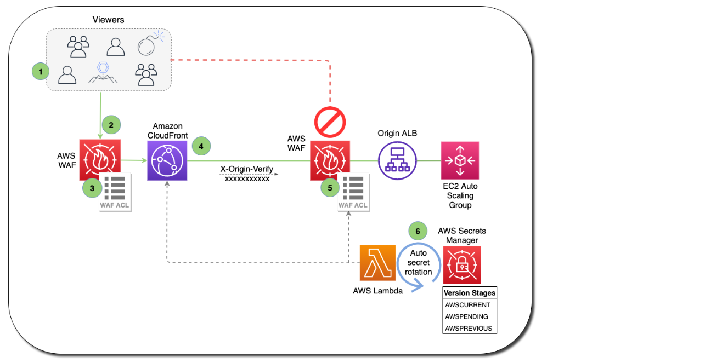
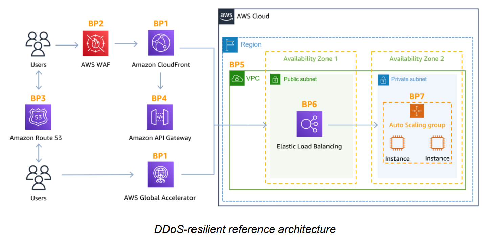

# DDoS Attacks Mitigation

## Key services
- AWS Shield Standard: protects against DDoS attack for your website and applications, for all customers at no additional costs
- AWS Shield Advanced: 24/7 premium DDoS protection
- AWS WAF: Filter specific requests based on rules
- CloudFront and Route 53: 
    - Availability protection using global edge network
    - Combined with AWS Shield, provides DDoS attack mitigation at the edge
- Be ready to scale – leverage AWS Auto Scaling
- Separate static resources (S3 / CloudFront) from dynamic ones (EC2 / ALB)

> Route 53 may prevent disruption, but does not stop DDoS attacks.

## Application Layer Defence
- Leverage both CloudFront and AWS WAF to help defend against application layer DDoS attacks
- CloudFront - cache static content, prevent non-web traffic from reaching your origin, automatically close connections from slow-reading/slow-writing attackers
- AWS WAF - Filter and block requests using web access control lists (ACLs). 
- WAF is NOT for DDoS protection. But can be used in conjunction with ALB, API Gateway (Regional or Edge) and CloudFront (Edge)  
- Allow or block based on URI, query string, HTTP method or Headers  
- To block attacks based on IP address reputation, you can create rules using IP match conditions or use Managed Rules for AWS WAF offered by sellers in the AWS Marketplace
- Use AWS Firewall Manager to centrally configure and manage security rules, such as AWS Shield Advanced protections and AWS WAF rules, across your organization.
- By configuring your origin to respond to requests only when they include a custom header that was added by CloudFront, you prevent users from bypassing CloudFront and accessing your origin content directly.

> Both WAF and CloudFront enable you to set Geo-restrictions to block or allow requests from selected countries. 

## Infrastructure Layer Defence
- To handle additional volume, use Dedicated EC2 instances, EC2 instances with N suffix, and support for enhanced networking with upto 100 Gbps of network bandwidth.
- EC2 auto-scaling to handle burst of traffic
- Elastic Load Balancing to route requests across multiple instances
- Application Load Balancer blocks many common DDoS attacks, such as SYN floods or UDP reflection attacks, protecting your application from the attack
- You can use AWS Shield Advanced to configure DDoS protection for Elastic IP addresses, when NLB is used - since NLB will not absorb attacks. 
- AWS edge locations provide additional layer of security (CloudFront, Global Accelerator, and Amazon Route 53)

> WAF vs. NACL (or) Security Groups: WAF is an excellent choice for filtering out malicious requests, but takes time. NACL is _quick and easy_ and can implement DENY. Security Groups implements *ONLY ALLOW*.

> For blocking a known set of malicious IPs, NACL is the easiest and quickest option.

## Protection across multiple accounts
- When managing AWS Shield Advanced protected resources in multiple accounts, you can set up centralized monitoring by using AWS Firewall Manager and AWS Security Hub. 
- With Firewall Manager, you can create a security policy that enforces DDoS protection compliance across all your accounts. 

## DDOS Resilient Reference Architecture

## Attack Surface Reduction
- Expose resources within private subnet, reducing attack surface. 
- Use API Gateway Region endpoint option, since it allows you to setup your own CloudFront Distribution.

## Best Practices

- Use Globally Distributed services like Amazon CloudFront and Amazon Route 53 
- Handle fluctuations in demand with Elastic Load Balancer 
- Prepare to scale compute to maintain availability (auto-scaling)
- Use Security Groups and Network ACLs with a Virtual Private Cloud (VPC) 
- Enable CloudWatch for metrics that matter to you 
- Enable Service Logs for Deeper Analysis 
- Enable AWS WAF for baselining layer 7 traffic 
- Enable Shield Advanced for advanced anomaly detection 
- Use AWS WAF to quickly block Layer 7 attacks 
- Use AWS Shield Advanced for effective incident response

> If you’re using Amazon S3 to serve static content on the internet, AWS recommends you use CloudFront to protect your bucket.

- Protect a web application and RESTful APIs against a DDoS attack:
    - Shield Advanced protecting an Amazon CloudFront distribution and an Application Load Balancer.
- Protect a TCP-based application against a DDoS attack:
    - Shield Advanced protecting an AWS Global Accelerator standard accelerator; attached to an Elastic IP address
- Protect a UDP-based game server against a DDoS attack:
    - Shield Advanced protecting an Amazon EC2 instance attached to an Elastic IP address
