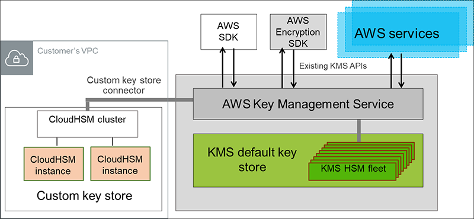

# Keys and Parameter Stores

## KMS (Key Management Service)
- KMS is a managed service that enables you to easily encrypt your data.
- Fully integrated with IAM for authorization.
- You can use AWS Identity and Access Management (IAM) policies in combination with key policies to control access to your customer AWS KMS keys.
- Integration with EBS, S3, Redshift, RDS, SSM.
- Symmetric: AES-256 keys
- Asymmetric: RSA & ECC Key pairs.
- Types of KMS Keys: Customer Managed vs. AWS Managed vs. AWS owned.
- KMS Key source - custom key store (Cloud HSM). Why? FIPS I40-2 Level 3 vs. Level 2 in KMS native.
- KMS Multi-region keys: One primary key in a region and replicas in additional regions.
- Audit use of keys by inspecting logs in AWS CloudTrail
- Creating your own KMS key gives you more control than you have with AWS managed KMS keys.
- You can schedule a AWS KMS key and associated metadata that you created in AWS KMS for deletion, with a configurable waiting period from 7 to 30 days.

> **KMS does not protect data in-transit!**

### Key Material
- The key material for a KMS key is generated within hardware security modules (HSMs) managed by AWS KMS. 
- Alternatively, you can import key material from your own key management infrastructure and associate it with a KMS key. 
- You can also have the key material generated and used in an AWS CloudHSM cluster as a part of the custom key store feature in AWS KMS.

> **Bring your Own Key (BYOK)**: You can use your company HSMs (on-premise) as an independent CMK source and import them to AWS KMS by **creating a CMK with no material and using EXTERNAL as the origin**. 

### Bring your Own Key

- Create a KMS key in AWS KMS that has no key material associated.
- Download the import wrapping key and import token from KMS.
- Import the wrapping key provided by KMS into the HSM.
- Create a 256 bit symmetric key on AWS CloudHSM.
- Use the imported wrapping key to wrap the symmetric key.
- Import the symmetric key into AWS KMS using the import token from step 2.
- Terminate your HSM, which triggers a backup. Delete or leave your cluster, depending on your needs.

### Custom Key store

> You can configure your own CloudHSM cluster and authorize AWS KMS to use it as a dedicated key store for your keys rather than the default AWS KMS key store.
KMS keys that are generated in your custom key store never leave the HSMs in the CloudHSM cluster in plaintext and all AWS KMS operations that use those keys are only performed in your HSMs.

### RDS Security
-  KMS encryption at rest for underlying EBS volumes / snapshots
- Can copy an un-encrypted RDS snapshot into an encrypted one
- Transparent Data Encryption (TDE) for Oracle and SQL Server

## SSM Parameter store ($)
- Secure storage for configuration and secrets
- Optional seamless encryption using KMS.
- Configuration management using path & IAM
- Parameters hierarchy: GetParameters or GetParametersByPath API.
- SSM Parameter provides an option to store values in plaintext or encrypt it with a KMS key. 

## AWS Secrets Manager ($$$)
- Storing secrets. Capability to force rotation of secrets every X days.
- Control access to secrets using resource based policy.
- Lambda function is provided for RDS, Redshift and DocumentDB
- KMS Encryption is mandatory.
- AWS Secrets Manager only stores encrypted data.

## Scenarios?

### When to use CloudHSM Custom store?

If you have stringent compliance requirements that mandate that you *manage your own HSM*. In this case, KS can use CloudHSM as a store.

