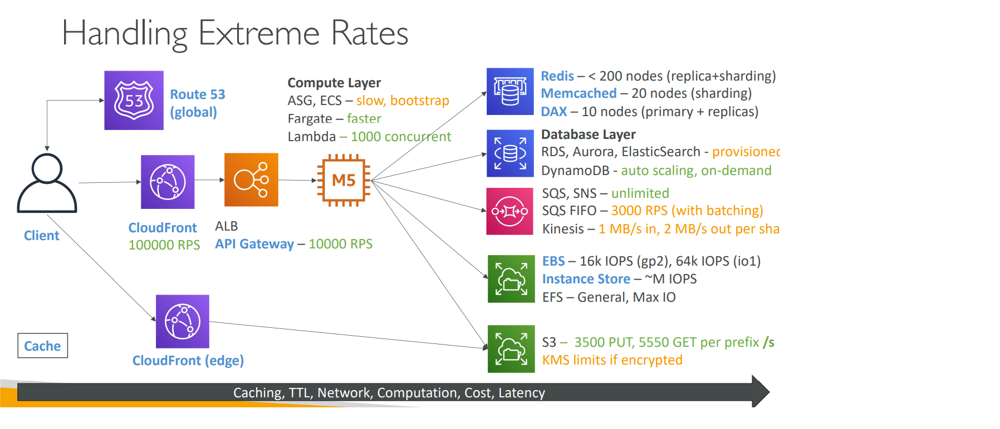

# CloudFront

## Salient Features
- Can have either S3 bucket as origin (with OAI) or can have ALB + EC2 Auto-scaling as origin (dynamic)
- Always use CloudFront as a cheaper option for cross-region access of both static and dynamic content!
- Cheaper than cross-region replication
- Geo-restriction, Signed URL
- Custom Header solution to restrict access of origins _only from CloudFront_
- Maximize cache hits by separating static and dynamic distributions (can cache based on headers and cookie for dynamic content)

## Edge functions
- Apply filtering or authentication or authorization logic at the edge
- Manipulate HTTP Requests and Responses
- Bot mitigation at the edge
- Edge location: CloudFront functions. Regional Edge Cache: Lambda@Edge Functions
- CloudFront functions: Very low latency (1ms).  Native feature of CloudFront (manage code entirely within CloudFront)
    - No access to request body
    - Only JavaScript   
- Lambda@Edge: NodeJs or Python. Scales to 1000s of requests per second. High Latency (5 seconds)
    - Load content based on user-device. Can re-write URLs based on the user agent.

## Field Level Encryption

- Field-level encryption adds an additional layer of security, along with HTTPS, that lets you protect specific data throughout system processing so that only certain applications can see it. 
- Field-level encryption allows you to securely upload user-submitted sensitive information to your web servers. 
- The sensitive information provided by your clients is encrypted at the edge closer to the user and remains encrypted throughout your entire application stack, ensuring that only applications that need the data—and have the credentials to decrypt it—are able to do so.

[Field Level Encryption](https://docs.aws.amazon.com/AmazonCloudFront/latest/DeveloperGuide/field-level-encryption.html#field-level-encryption-setting-up)

## Cache Hit Ratio

- To increase your cache hit ratio, you can configure your origin to add a Cache-Control max-age directive to your objects, and specify the longest practical value for max-age. 
- CloudFront Origin Shield can help improve the cache hit ratio of your CloudFront distribution, because it provides an additional layer of caching in front of your origin. 
- Cache based on query string parameters
- Caching based on cookie values - for dynamic origins.
- Caching based on request headers

## Video on Demand and Live streaming

You can use CloudFront to deliver video on demand (VOD) or live streaming video using any HTTP origin. One way you can set up video workflows in the cloud is by using CloudFront together with AWS Media Services.

> You must use an encoder to package video content before CloudFront can distribute the content. The packaging process creates segments that contain your audio, video, and captions content. It also generates manifest files, which describe in a specific order what segments to play and when. Common package formats are MPEG DASH, Apple HLS, Microsoft Smooth Streaming, and CMAF.

### Video on Demand

After your video is packaged into the right formats, you can store it on a server or in an Amazon S3 bucket, and then deliver it with CloudFront as viewers request it.

### Live streaming

For live video streaming, your video content is streamed real time as live events happen, or is set up as a 24x7 live channel. To create live outputs for broadcast and streaming delivery, use an encoder such as AWS Elemental MediaLive, to compress the video and format it for viewing devices. 